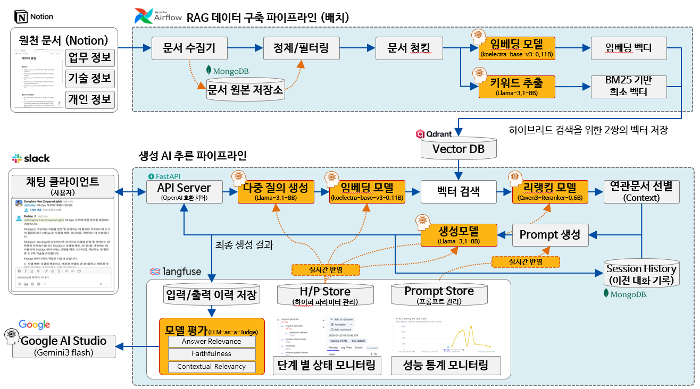

# MyDobby — 나만의 비서 로컬 RAG 시스템

Notion을 데이터 소스로, 로컬 LLM을 활용한 RAG(Retrieval-Augmented Generation) 시스템입니다.  
Slack을 UI로, FastAPI 서버를 통해 OpenAI 호환 API를 제공합니다.

### 아키텍처


---

## 파이프라인 구조

### 데이터 수집 파이프라인 (오프라인)

```
Notion → MongoDB(raw_documents) → 청킹/임베딩 → Qdrant(parent_chunks, child_chunks)
```

1. **Notion 크롤링** — 루트 블록부터 BFS로 순회, 50자 이상·마지막 수집 이후 수정된 블록만 저장
2. **MongoDB 저장** — 원본 문서를 `raw_documents` 컬렉션에 저장
3. **Parent Chunking** — `[HEADER]` 기준으로 문서를 섹션 단위로 분리
4. **Child Chunking** — 문장 단위로 512자 청크 생성 (50자 오버랩)
5. **임베딩** — KoELECTRA (Dense Vector)
6. **키워드 추출** — MeCab POS 태거 (NNP, NNG, SL 명사 추출) → BM25 Sparse Vector
7. **Qdrant 저장** — Dense + Sparse 이중 벡터로 저장

### 추론 파이프라인 (온라인)

```
사용자 질문 (Slack / HTTP)
→ 다중 질의 생성 (Llama 3.1 8B)
→ 키워드 추출 (MeCab)
→ 하이브리드 검색 (Dense + Sparse, RRF k=60)
→ 리랭킹 (Qwen3-Reranker-0.6B, threshold 0.1)
→ Parent Chunk 집계 (Child rerank score 합산, Top 5)
→ LLM 생성 (Llama 3.1 8B)
→ 응답
```

---

## 실행 방법

### 사전 요구사항

로컬에서 아래 서비스가 실행 중이어야 합니다.

| 서비스 | 주소 | 용도 |
|--------|------|------|
| MongoDB | `localhost:27017` | 원본 문서 및 세션 저장 |
| Qdrant | `localhost:6333` | 벡터 검색 |
| Langfuse | `localhost:3000` | 프롬프트 관리 및 트레이싱 |

### 의존성 설치

```bash
poetry install
```

### API 서버 실행

서버 시작 시 Llama 3.1 8B, Qwen3-VL-Embedding-8B 모델을 로드하며 시간이 걸립니다.

```bash
python -m apiserver.main
# 또는
uvicorn apiserver.main:app --host 0.0.0.0 --port 18000 --reload
```

### Notion 데이터 수집

```bash
python -m gather_data.gather
```

### Qdrant 재구축 (청킹 + 임베딩)

```bash
python -m retrieve.embedding
```

### Jupyter Lab (SFT 학습, 임베딩 실험 등)

```bash
jupyter lab
```

---

## API 엔드포인트

| 메서드 | 경로 | 설명 |
|--------|------|------|
| `POST` | `/rag` | RAG 응답 (단순 인터페이스) |
| `POST` | `/chat/completions` | OpenAI 호환 채팅 API |
| `POST` | `/chat/test` | RAG 중간 과정 포함 디버그 응답 |
| `POST` | `/context` | 관련 문서 검색만 수행 |
| `GET`  | `/v1/models` | 사용 가능한 모델 목록 |

#### 지원 모델 (`/chat/completions`)
- `dobby` — RAG 파이프라인 전체 실행
- `llama3.1` — RAG 없이 LLM 직접 호출

---

## 모델 스택

| 역할 | 모델 |
|------|------|
| 메인 LLM | `meta-llama/Llama-3.1-8B-Instruct` (torch.compile 적용) |
| Dense 임베딩 | KoELECTRA base 0.11B |
| 임베딩 (전환 예정) | `Qwen/Qwen3-VL-Embedding-8B` |
| 리랭커 | `Qwen/Qwen3-Reranker-0.6B` |
| 키워드 추출 | MeCab POS 태거 |

---

## 모듈 구조

| 모듈 | 역할 |
|------|------|
| `apiserver/` | FastAPI 서버. 엔드포인트, RAG 파이프라인 오케스트레이션, Slack 봇, 프롬프트 생성 담당 |
| `gather_data/` | 데이터 수집 파이프라인. Notion API 크롤링 후 MongoDB에 원본 문서 저장 |
| `retrieve/` | 검색 및 청킹/임베딩. Child 검색 → 리랭킹 → Parent 집계 3단계 검색과 문서 전처리 담당 |
| `models/` | 모델 레지스트리 및 래퍼. `get_model(name)`으로 지연 로딩 및 캐싱, LLM·임베딩·리랭커·키워드 추출기 포함 |
| `external/` | 외부 서비스 연결. Qdrant·MongoDB·Langfuse 연결 팩토리 및 CRUD 쿼리 |
| `session/` | 대화 이력 관리. 사용자 ID 기준으로 MongoDB에 세션 저장·조회 |
| `sft/` | LoRA 파인튜닝 노트북 및 체크포인트 |
| `eval/` | RAG 파이프라인 평가 스크립트 |
| `utils/` | 공통 유틸리티 |
| `docs/` | 문서 및 아키텍처 이미지 |

---

## 세션 관리

사용자 ID 기준으로 독립적인 대화 이력을 관리합니다.

- **저장소**: MongoDB `chat_sessions` 컬렉션
- **구조**: `user_id` + `messages[]` (role, content, model, timestamp)
- **Slack**: `event.get("user")`로 user_id 추출
- **HTTP**: `user_id`, `history_limit` 파라미터로 제어 (기본값: 최근 5개 대화)

## Langfuse 연동

- **프롬프트 관리**: `answer`, `query_expansion`, `keyword_extraction`, `like_dobby`, `not_found_context` 프롬프트를 Langfuse에서 버전 관리
- **트레이싱**: 파이프라인 전 단계 (query expansion → retrieve → rerank → generate) 추적
